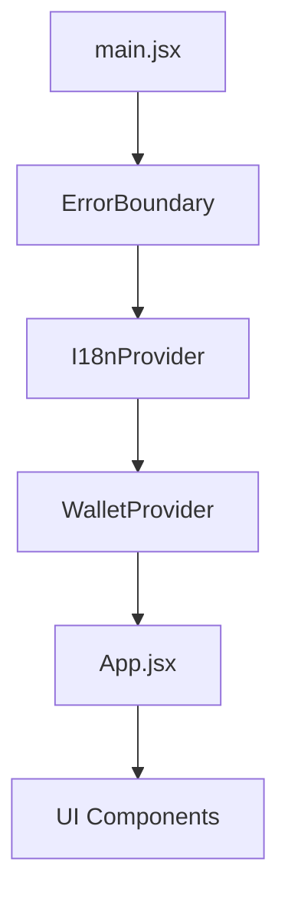

# Stacks Clicker v2 - Technical Architecture

This document outlines the high-level architecture, data flow, and design patterns used in the Stacks Clicker v2 project.

## System Overview

Stacks Clicker v2 is a decentralized interaction hub built on the Stacks blockchain. It provides a gamified interface for performing on-chain transactions (clicks, tips, votes) with real-time feedback and premium UI/UX.

### Core Technologies
- **Frontend**: React (Vite), Framer Motion (Animations), Tailwind CSS (Theming)
- **Blockchain**: Stacks (Clarity Smart Contracts)
- **State Management**: React Context (Wallet, I18n) + Custom Hooks
- **Persistence**: LocalStorage with cross-tab synchronization

## Provider Hierarchy

The application follows a strict provider hierarchy to ensure predictable state flow:

- **I18nProvider**: Manages multi-language support.
- **WalletProvider**: Manages Stacks authentication and session state.
- **ErrorBoundary**: Catches and displays fallback UI for runtime crashes.

## State Orchestration

### Global State (Context)
- `useWallet()`: Unified interface for connection status and address.
- `useI18n()`: Translation strings and locale switching.

### Interaction Layer (Hooks)
We use a **Collector Pattern** to aggregate contract interactions:

- `useInteractions()`: The master hook that provides `clicker`, `tipjar`, and `quickpoll` namespaces.
- `useClicker()`, `useTipJar()`, `useQuickPoll()`: Domain-specific hooks handling Clarity contract-calls.
- `useSound()`: Global acoustic feedback for user actions.

## Data Flow: On-Chain Interaction

1. **User Action**: User clicks a button in `ClickerCard`.
2. **Hook Execution**: `handleAction` plays sound and calls `clicker.click()`.
3. **Contract Call**: `useClicker` triggers `@stacks/connect` with optimistic loading.
4. **Callback**: On broadcast, `onTxSubmit` in `App.jsx` is triggered.
5. **UI Update**: `addTxToLog` updates the history, increments local stats, and triggers particles.

## Design Patterns

### 1. Memoization Strategy
- All common components (`ActionButton`, `ActionCard`, etc.) are wrapped in `React.memo` to prevent unnecessary re-renders during high-frequency interactions.
- Complex hooks use `useCallback` for stable function references.

### 2. Loading State Management
- `loadingStates` are managed as an object/map in each hook, allowing independent loading indicators for different contract functions within the same card.

### 3. Glassmorphism & Theming
- The UI uses a "Glassmorphism" design system defined in `index.css` via CSS variables (`--bg-primary`, `--glass-bg`).
- Themes are applied at the `:root` level and persisted across sessions.

## Performance Considerations
- **Lazy Loading**: `MainGrid`, `PlayerStats`, and `TransactionHistory` are lazy-loaded via `React.lazy` and `Suspense` to improve initial Load Time.
- **Asset Optimization**: SVGs are used for icons to ensure sharpness and small bundle size.
- **Telemetry**: `PerformanceOverlay` provides real-time FPS and MEM monitoring during development (`?dev=true`).

---
*Created by Antigravity - Advanced Agentic Coding @ Google DeepMind*
