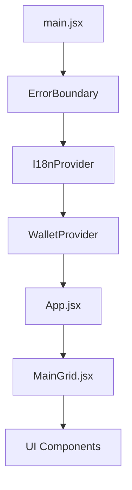
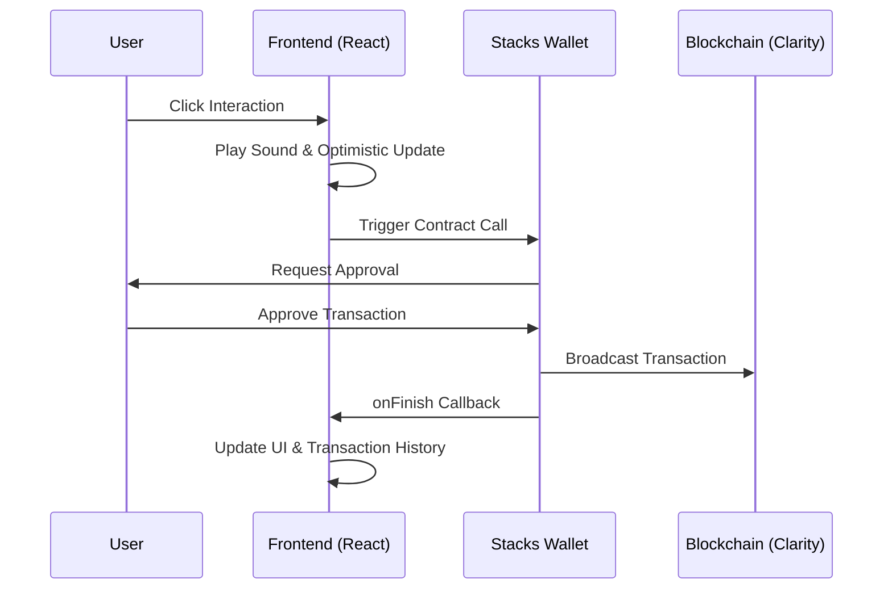

# Stacks Clicker v2 - Technical Architecture

This document outlines the high-level architecture, data flow, and design patterns used in the Stacks Clicker v2 project.

## System Overview

Stacks Clicker v2 is a decentralized interaction hub built on the Stacks blockchain. It provides a gamified interface for performing on-chain transactions (clicks, tips, votes) with real-time feedback and premium UI/UX.

### Core Technologies
- **Frontend**: React (Vite), Framer Motion (Animations), CSS variables and global stylesheets
- **Blockchain**: Stacks (Clarity Smart Contracts)
- **State Management**: React Context (Wallet, I18n) + Custom Hooks
- **Persistence**: LocalStorage with cross-tab synchronization

## Provider Hierarchy

The application follows a strict provider hierarchy to ensure predictable state flow:

- **I18nProvider**: Manages multi-language support and locale-aware string resolution.
- **WalletProvider**: Manages Stacks authentication, session state, and account derivation.
- **ErrorBoundary**: Catches and displays fallback UI for runtime crashes, ensuring the entire app doesn't go dark on a single failure. It logs errors to the console and provides a "Retry" mechanism for users to reload without losing session state.

## Interaction Layer: Collector Pattern
The application uses a **Collector Pattern** to aggregate domain-specific contract logic into a single consumption point:
- `useInteractions()`: Acts as the collector, initializing hooks for `clicker`, `tipjar`, and `quickpoll`.
- **Decoupled Logic**: Each domain hook contains its own loading states and transaction submission logic, allowing for independent UI updates.

### Global State (Context)
- `useWallet()`: Unified interface for connection status and address.
- `useI18n()`: Translation strings and locale switching.

### Interaction Layer (Hooks)
The interaction layer exposes contract calls through domain-specific hooks:

- `useInteractions()`: The master hook that provides `clicker`, `tipjar`, and `quickpoll` namespaces.
- `useClicker()`, `useTipJar()`, `useQuickPoll()`: Domain-specific hooks handling Clarity contract-calls.
- `useSound()`: Global acoustic feedback for user actions.

## Data Flow: On-Chain Interaction

1. **User Action**: User clicks a button in `ClickerCard`.
2. **Hook Execution**: `handleAction` plays sound and calls `clicker.click()`.
3. **Contract Call**: `useClicker` triggers `@stacks/connect` with optimistic loading.
4. **Callback**: On broadcast, `onTxSubmit` in `App.jsx` is triggered.
5. **UI Update**: `addTxToLog` updates the history, increments local stats, and triggers particles.

## Design Patterns

### 1. Memoization Strategy
- Many interactive card and shared UI components use `React.memo` to reduce avoidable re-renders during high-frequency interactions.
- Hooks and event handlers lean on `useCallback` where stable function references help downstream components.

### 2. Loading State Management
- `loadingStates` are managed as an object/map in each hook, allowing independent loading indicators for different contract functions within the same card.

### 3. Glassmorphism & Theming
- The UI uses a "Glassmorphism" design system defined in `index.css` via CSS variables (`--bg-primary`, `--glass-bg`).
- Themes are applied at the `:root` level and persisted across sessions.

### Persistence & Sync
- **LocalStorage**: Game state (clicks, streaks, settings) is persisted to `localStorage` via the `useLocalStorage` hook.
- **Cross-tab Synchronization**: The application listens for `storage` events to ensure that if a user has multiple tabs open, their stats and theme remain consistent across all of them.
- **Optimistic Updates**: On-chain interaction hooks update local state *before* the transaction is confirmed to provide an instant feel.

## Performance Considerations
- **Lazy Loading**: `MainGrid`, `PlayerStats`, and `TransactionHistory` are lazy-loaded via `React.lazy` and `Suspense` to improve initial load time.
- **Asset Optimization**: SVGs are used for icons to ensure sharpness and small bundle size.
- **Telemetry**: `PerformanceOverlay` provides real-time FPS and MEM monitoring during development (`?dev=true`).

## Related References

| Document | Description |
| :--- | :--- |
| [README.md](README.md) | Onboarding and local setup guide |
| [docs/frontend/README.md](docs/frontend/README.md) | Component and hook documentation |
| [CONTRIBUTING.md](CONTRIBUTING.md) | Contribution guidelines and standards |
| [docs/GETTING_STARTED.md](docs/GETTING_STARTED.md) | Detailed getting started guide |
| [docs/operations/README.md](docs/operations/README.md) | Operations runbooks and checklists |

---
*Created by Antigravity - Advanced Agentic Coding @ Google DeepMind*
