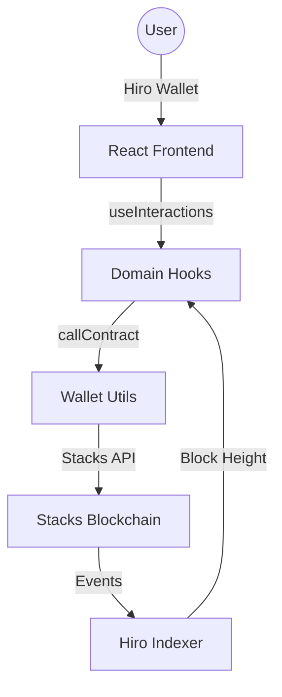

# Stacks Clicker 🚀

A premium, high-performance decentralized interaction hub on the Stacks blockchain. Built for speed, aesthetics, and seamless on-chain activity.

## Vision 🔗
Stacks Clicker aims to be more than just a game; it is a gateway for users to explore the Stacks ecosystem through simplified, gamified on-chain actions. By lowering the barrier to entry, we foster a more active and engaged Bitcoin L2 community.


## Project Structure 📁

- `contracts/`: Clarity smart contracts [detailed here](contracts/README.md).
- `frontend/`: React-based web application (Vite, Framer Motion).
- `deployments/`: Network-specific deployment plans.
- `settings/`: Clarinet network configuration files (simnet/devnet).
- `docs/`: Additional technical documentation and guides.
- `tests/`: Clarinet test suites for smart contracts.
- `Makefile`: Root-level automation for development and deployment.

## Features 🌟

- **🎯 Power Clicker**: High-frequency on-chain clicker with "Turbo 10x" batching.
- **💰 TipJar**: Support creators and generate activity with quick and custom tips.
- **🗳️ QuickPoll**: Decentralized voting and poll creation for community engagement.
- **🔥 Interaction Streaks**: Gamified engagement tracking with earned achievement badges.
- **🌍 Multi-language**: Current I18n support includes English and Spanish.
- **🛡️ Secure Wallet**: Seamless integration with the Stacks/Hiro wallet.
- **⚡ Performance First**: Zero-lag UI with glassmorphism, lazy loading, and memoized components.

## Getting Started 🛠️

### Prerequisites
- **Node.js**: v18.0.0 or higher (LTS recommended)
- **npm**: v9.0.0 or higher (comes with Node.js)
- **Stacks Wallet**: Hiro Wallet or Leather extension
- **Clarinet**: Required for smart contract development and testing

### Local Discovery
- Clarinet is recommended for local smart contract testing and development.
- Docker is required for spinning up a local Stacks Devnet environment.

### Smart Contract Development (Optional)
If you wish to modify, test, or deploy the Stacks smart contracts locally:
1. Initialize the local devnet container:
   ```bash
   clarinet integrate
   ```
2. Run the test suite:
   ```bash
   clarinet test
   ```
3. Check contract syntax and static analysis rules:
   ```bash
   clarinet check
   ```

### Frontend Installation
1. Clone the repository:
   ```bash
   git clone https://github.com/AdekunleBamz/stacks-clicker.git
   ```
2. Install dependencies:
   ```bash
   cd stacks-clicker
   npm run frontend:install
   ```
   Note: `npm ci` is recommended for deterministic installs. Use `npm install` for manual package updates.
3. Configure environment variables:
   Copy the example file in the `frontend` directory and update the required values:
   ```bash
   cp frontend/.env.example frontend/.env
   ```
   ```env
   VITE_WALLETCONNECT_PROJECT_ID=your_project_id_here
   VITE_DEPLOYER_ADDRESS=SP5K2RHMSBH4PAP4PGX77MCVNK1ZEED07CWX9TJT
   VITE_DEBUG=true
   ```
   Set `VITE_DEPLOYER_ADDRESS` to the principal that deployed the app contracts.
   Optional values such as `VITE_STACKS_NETWORK` and `VITE_COINGECKO_API_KEY` are documented in `frontend/.env.example`.
4. Start the development server:
   ```bash
   npm run frontend:dev
   ```
   Build for production when needed:
   ```bash
   npm run frontend:build
   ```

## UX & Accessibility Enhancements

This project has undergone a comprehensive 94-PR improvement cycle focusing on:
- **ARIA Compliance**: Full semantic HTML5 and WAI-ARIA role coverage.
- **Keyboard Navigation**: Optimized focus management and global escape-key handlers.
- **Motion Design**: Standardized cubic-bezier transitions and reduced-motion support.
- **Loading UX**: Robust skeleton loaders, shimmers, and pulse animations for all network states.
- **Error Handling**: Graceful error boundaries and contextual validation feedback.

### ⚡ Quick Setup

```bash
# Clone
git clone https://github.com/AdekunleBamz/stacks-clicker.git && cd stacks-clicker

# Install & Run
npm run frontend:install && cp frontend/.env.example frontend/.env && npm run frontend:dev

# Run frontend tests
npm run frontend:test:run

# Run fast frontend smoke checks
npm run frontend:smoke

# Run quick repo validation
npm run check:fast
```

## Key Interactions 🎮

| Feature | Action | Reward | Shortcut |
| :--- | :--- | :--- | :--- |
| **Power Clicker** | On-chain Click | Clicks + Streaks | `C` |
| **TipJar** | STX Donation | Karma + Activity | `T` |
| **QuickPoll** | Governance Vote | Voice + Influence | - |

## Known Limitations ⚠️

- **Network Latency**: High traffic on the Stacks network can lead to delayed transaction confirmation.
- **Wallet Compatibility**: Optimized for Hiro and Leather; other SIP-010 compatible wallets may vary in experience.
- **Testnet Focus**: Some features are currently tuned for mock/testnet environments and may require adjustments for high-value mainnet usage.

## Technical Architecture 🏗️



- **Frontend**: Vite + React + Framer Motion for a 60fps glassmorphic UI.
- **State Management**: Context API for global wallet and I18n state; custom hooks for domain logic.
- **On-chain**: Integrated with `@stacks/transactions` and Hiro API for real-time blockchain telemetry.
- See [ARCHITECTURE.md](ARCHITECTURE.md) for full end-to-end interaction flow details.

## Security & Verification 🔑

Shared branch commits should be SSH signed before they are pushed. You can confirm the latest signature locally with `git log -1 --show-signature` and verify the pushed commit through GitHub's `Verified` badge.

## Troubleshooting 🔍

- **Blank QR Code**: Ensure `VITE_WALLETCONNECT_PROJECT_ID` is correctly set in your `.env` file and that you have a stable internet connection.
- **Transaction Failed**: Check if you have enough STX for gas fees. Re-connecting your wallet can often resolve stale session issues.
- **Nonce Out of Sync**: If transactions fail with a "nonce" error, try manually incrementing the nonce in your wallet settings or wait a few minutes for the network to sync.
- **Contract Not Found**: Ensure you are on the correct network (Mainnet vs Testnet) by checking the toggle in the app header and your wallet extension.
- **UI Not Updating**: Try a hard refresh (`Cmd+Shift+R` or `Ctrl+F5`) to clear the local cache and reload the latest assets.

## License 📄

MIT License. See [LICENSE](LICENSE) for details.

---
Built and maintained by the Stacks Clicker contributors.
